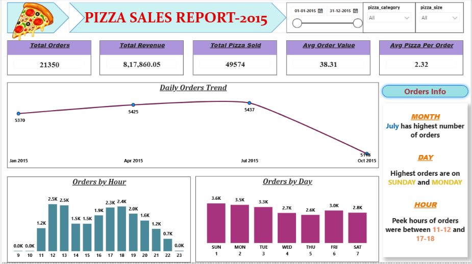
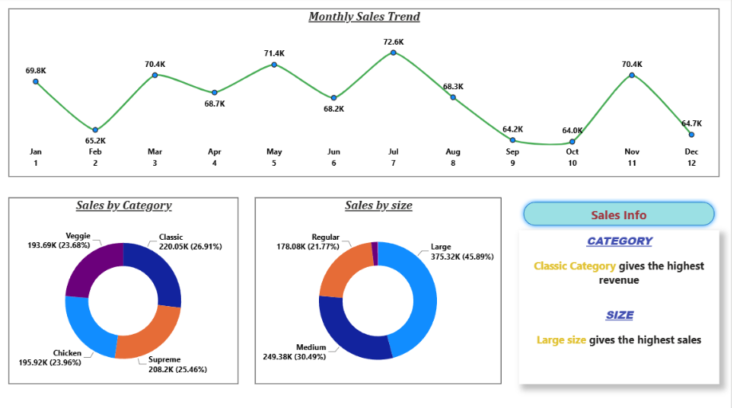
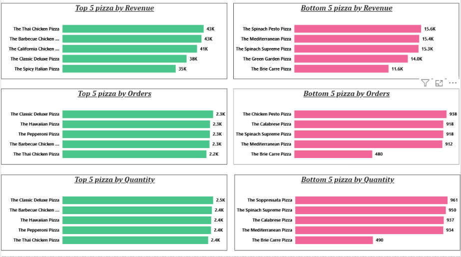

# 🍕 Pizza Sales Analysis

## 📌 Project Overview

This project analyzes pizza sales data to identify sales trends, customer ordering patterns, pizza category performance, pizza size preferences, and top and bottom performing pizzas.

The project was completed using \*\*Microsoft Excel, MySQL, and Power BI\*\*, covering data preparation, SQL-based analysis, KPI calculation, and interactive dashboard development.

## 🛠️ Tools \& Technologies

Microsoft Excel – Data preparation and initial analysis

MySQL – SQL-based data analysis

Power BI – Interactive dashboard and data visualization

Power Query – Data transformation

DAX – KPI and analytical measures

## 🔄 Project Workflow

1\. Prepared and explored the pizza sales data using Excel.

2\. Imported the dataset into MySQL.

3\. Used SQL queries to analyze revenue, orders, pizza quantity, categories, sizes, time trends, and top/bottom performing pizzas.

4\. Connected MySQL to Power BI.

5\. Performed data transformation using Power Query.

6\. Created DAX measures for key performance indicators.

7\. Built an interactive Power BI dashboard to present the analysis.

## 📊 Key Performance Indicators

| KPI                      |      Value |

| ------------------------ | ---------: |

| Total Revenue            | 817,860.05 |

| Total Orders             |     21,350 |

| Total Pizzas Sold        |     49,574 |

| Average Order Value      |      38.31 |

| Average Pizzas per Order |       2.32 |

## 📈 Dashboard Pages

### 1. Overview

The Overview page contains:

\* Total Revenue

\* Total Orders

\* Total Pizzas Sold

\* Average Order Value

\* Average Pizzas per Order

\* Daily Orders Trend

\* Orders by Hour

\* Orders by Day

\* Key business insights

### 2. Sales Analysis

The Sales page contains:

\* Monthly Sales Trend

\* Sales by Pizza Category

\* Sales by Pizza Size

\* Category and size insights

### 3. Top \& Bottom 5 Analysis

The Top/Bottom 5 page analyzes:

\* Top 5 Pizzas by Revenue

\* Bottom 5 Pizzas by Revenue

\* Top 5 Pizzas by Orders

\* Bottom 5 Pizzas by Orders

\* Top 5 Pizzas by Quantity

\* Bottom 5 Pizzas by Quantity

## 🔍 Key Insights

\* July recorded the highest number of orders.

\* Sunday and Monday recorded the highest number of orders.

\* Peak ordering periods were around 12–13 and 17–18.

\* The Classic pizza category generated the highest revenue.

\* Large-size pizzas generated the highest revenue contribution.

\* The Classic Deluxe Pizza was one of the top-performing pizzas by quantity and orders.

\* The dashboard identifies the highest- and lowest-performing pizzas across revenue, orders, and quantity.

## 🎯 Project Objective

The objective of this project is to transform raw pizza sales data into meaningful business insights using Excel, SQL, and Power BI.

The final dashboard helps users understand sales performance, ordering patterns, product performance, and key business metrics through interactive visualizations.

## 👨‍💻 Author

\*\*Sumanth Shetty\*\*

Aspiring Data Analyst

\*\*Skills:\*\* SQL | Excel | Python | Power BI

